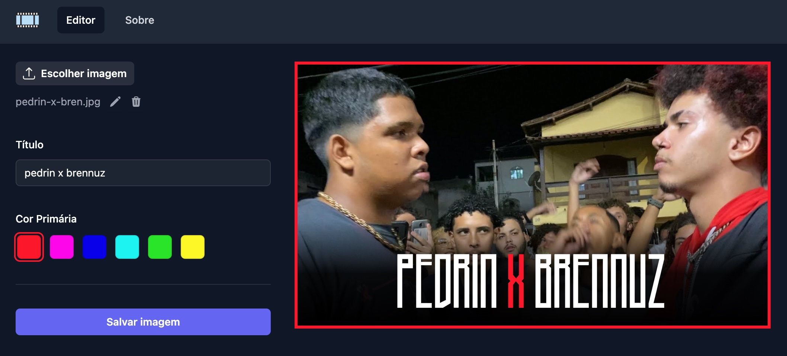

# Miniatura de Vídeo para Batalhas de Rima

*Agora mano a miniatura vai ser de nível – [MC Pedrin](https://youtube.com/clip/Ugkx4UTc6muqeRVlpb5LSJLv-_x4MXGAKnng)*

Todas as semanas centenas de batalhas de rima acontecem no Brasil e parte consideravel destas são carregadas no YouTube. Como membro da organização de uma batalha ([@bdlaprata](https://instagram.com/bdlaprata/)), subimos em média 15 vídeos por semana, e um dos trabalhos é gerar boas miniaturas/thumbnails para aumentar o alcance das publicações.

A motivação deste site é agilizar o processo de criação e tornar mais acessível a criação de miniaturas para organizações de batalhas que não tenham tempo ou recursos para elaborar um bom design.

Por exemplo, com uma breve busca no YouTube é possível notar o contraste de miniaturas entre uma batalha de menor visibilidade ([Batalha da Glória](https://www.youtube.com/@batalhadagloria/)) e uma batalha profissional ([Batalha da Aldeia](https://www.youtube.com/@batalhadaaldeia)).


Após carregar a miniatura original do vídeo da Batalha da Glória na aplicação, um resultado melhor é obtido com pouco esforço.



Ao salvar a imagem, um arquivo PNG de resolução 1280 × 720 (16:9) é exportado para o computador. [Esta já é a resolução ideal para o YouTube](https://support.google.com/youtube/answer/72431?hl=en#zippy=%2Cimage-size-resolution).

Apesar de funcional, muitas melhorias podem ser integradas à aplicação, como adição de múltiplos estilos, cores diferentes, alteração de fontes, entre outros. Dependendo do interesse da comunidade, posso evoluir as funcionalidades.

## Como executar a aplicação localmente

Se você for um programador, siga esses passos para executar a aplicação localmente.

Primeiro, inicie o servidor de desenvolvimento local:

```bash
yarn dev
```

Abra [http://localhost:3000](http://localhost:3000) em seu navegador para ver a aplicação e edite o código no arquivo `app/page.tsx` para ver as alterações em tempo-real.